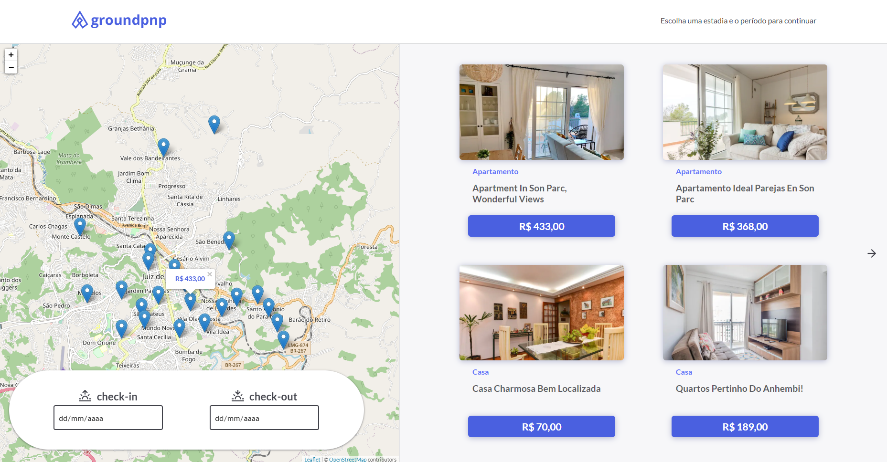

# Desafio Hiring Coders - Página similar ao Airbnb 🐱‍🏍

[Veja o projeto aqui](https://groundpnp.netlify.app/)

O desafio consistia em criar uma página de escolha de quartos através do consumo de uma API disponibilizada pelo mesmo. Era necessário conseguir, principalmente, mostrar os quartos e suas informações em cards usando Flexbox e para ir mais além adicionar coisas como:

- Cálculo total do valor de estadia
- Utilizar uma integração com api do Google Maps
- Paginação para melhor performanceda página 
- ou qualquer outra coisa que julgasse interessante. 

Tudo isso, com Javascript puro.

### 🎯 Features finalizadas 🎯

- [x] Listagem de quartos com Flexbox
- [x] Paginação de cards em tela
- [x] Integração com API de mapas (Leaflet e Google Maps)
- [x] Cálculo do valor total da Estadia

Apesar de inicialmente ter criado o site com Google Maps e estar funcional, optei por mudar para Leaflet por não necessitar cadastrar pagamento como no caso do google (mesma que ele ofereça os créditos para teste). O mapa abria mas com um aviso de erro e um overlay de "Development Purposes Only" que acredito contribuirem para uma pior experiência ainda que em um projeto que não vá ser usado por clientes finais.